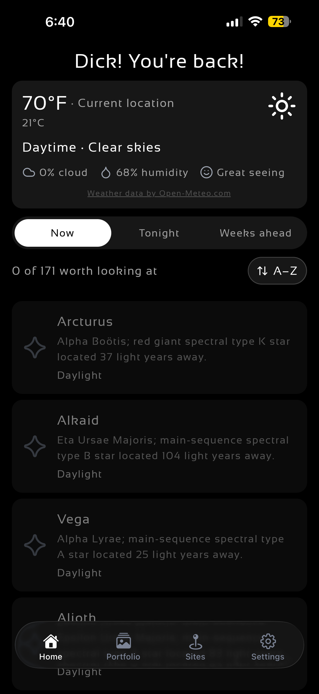
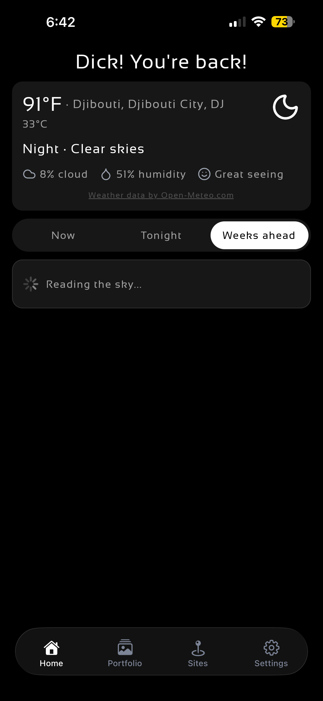
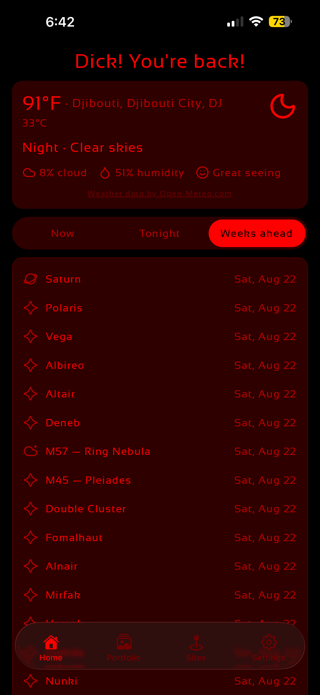
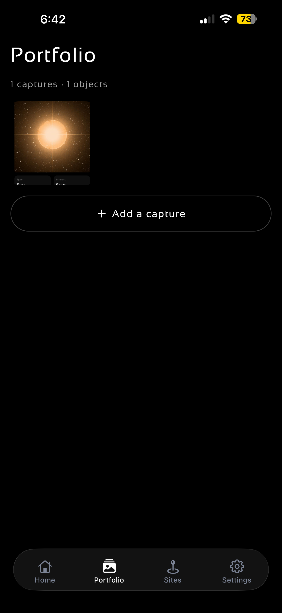
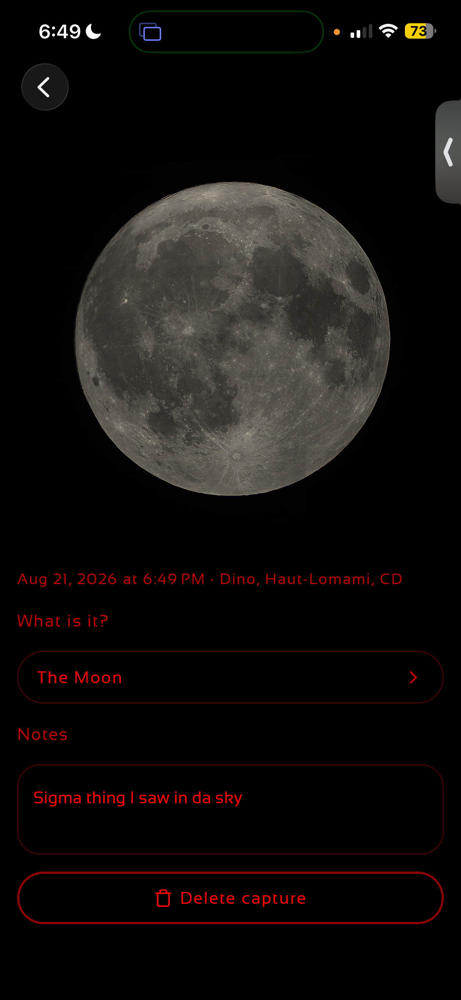
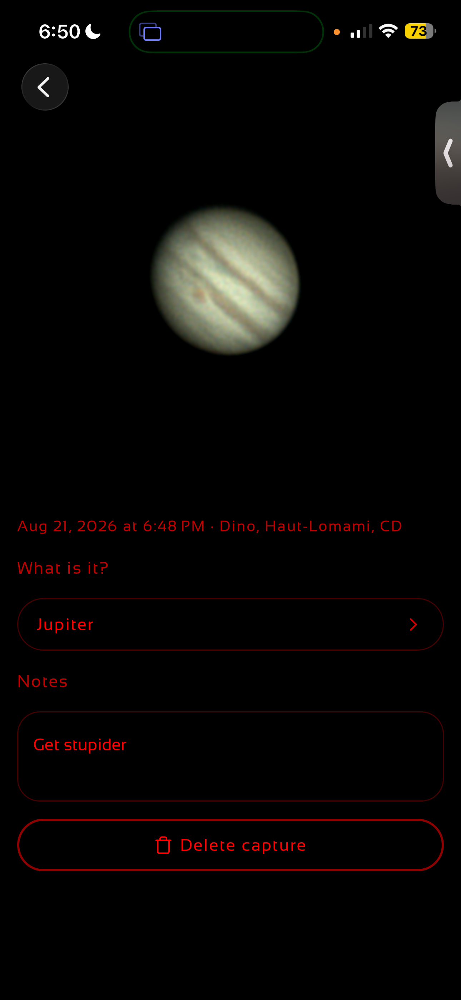
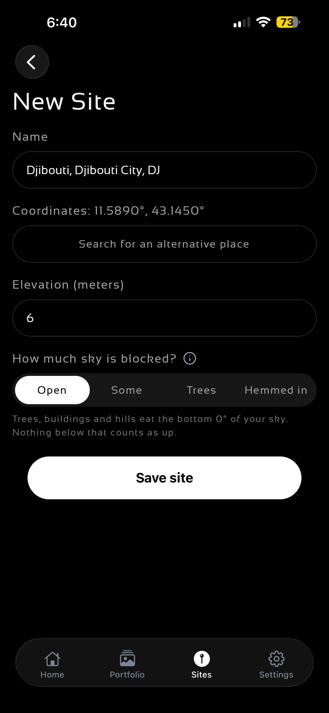
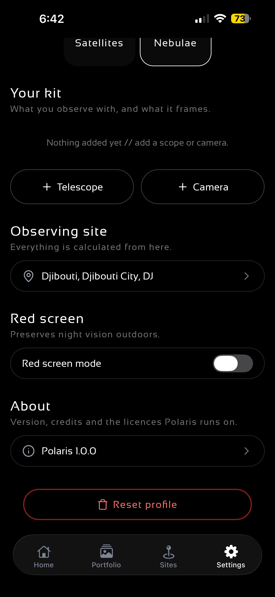

## Polaris v1.0.0 // Beta

First Android build. A stargazing planner: pick your site, see what's actually
worth looking at tonight, and whether the sky will cooperate.

### What's in it

- **Tonight's lookahead** — hour-by-hour visibility graphs so you can pick your window
- **Weather overview** — cloud cover and conditions from Open-Meteo, no API key or account
- **Sites** — save observing locations and switch between them
- **Portfolio** — track the objects you're chasing
- **Object pages** — position, rise/set, and phase for planets and the Moon
- **Onboarding** — tell it your interests and equipment so suggestions match what you can actually see
- Dark theme throughout, built for red-light-friendly night use

Everything is stored locally in SQLite. No account, no login, no data leaves your phone
apart from a weather lookup for your site.

### Install

1. Download `Polaris-v1.0.0-Beta.apk` below
2. Open it on your phone, allow "install from unknown sources" when prompted
3. Grant location permission — it's used to place your observing site

Android only for now. ~96.66 MB.

## Privacy Policy

https://b1j2754.github.io/Polaris/privacy.html

## AI-Disclosure

See the [Disclosure Document](/docs/AI-Disclosure.md)

## Third-party

- Positional astronomy (i.e. planet and Moon ephemerides, precession, the horizontal transform and phase) is [astronomy-engine](https://github.com/cosinekitty/astronomy) by Don Cross, MIT licence.
- Weather comes from [Open-Meteo](https://open-meteo.com/), free for non-commercial use, no key.
- Deep-sky preview images are cutouts from the [Digitized Sky Survey](https://archive.stsci.edu/dss/acknowledging.html), rendered on demand by the [CDS hips2fits](https://alasky.cds.unistra.fr/hips-image-services/hips2fits) service (Strasbourg), non-commercial use, no key.
- Icon artwork is copied from [lucide](https://lucide.dev) (ISC)
    - see `src/components/icon.tsx`.

For a full overview, see the [Third Party Notice](/docs/THIRD-PARTY-NOTICES.md)

## Gallery

| | | |
|:-:|:-:|:-:|
|  |  |  |
| **Now** — weather, seeing, and what's up | **Weeks ahead** — plan further out | **Red screen mode** — night vision intact |
|  |  |  |
| **Portfolio** — your captures | **Capture** — the Moon, with notes | **Capture** — Jupiter, tagged to an object |
|  |  | |
| **New site** — coordinates, elevation, horizon | **Settings** — kit, site, red screen | |
